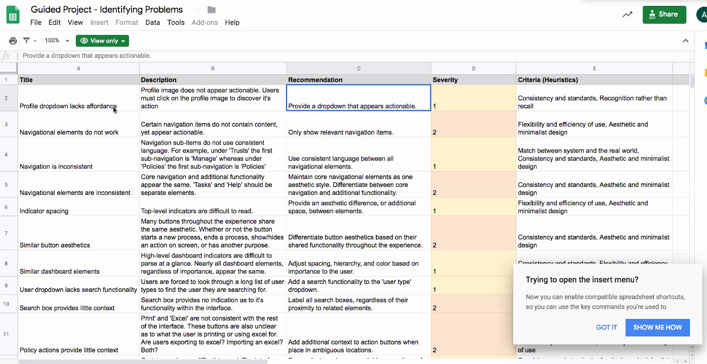
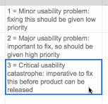

# Identifying Problems 

Table of Contents:  

a. [Additional Resources](#Additional-Resources)     
b. [UX Debt](#UX-Debt)      
c. [Usability Heuristics](#Usability-Heuristics)      
d. [Identifying Opportunities](#Identifying-Opportunities)      
e. [Tracking and Prioritizing Issues](#Tracking-and-Prioritizing-Issues)      

 

## Additional Resources

#### Pre-Class Videos

[UX Debt (3 min)](https://youtu.be/2rtfms2P4sI)  

[Identifying, Tracking and Prioritizing Problems (5 min)](https://youtu.be/o5a9v-bY844) 

#### Assignment

[Identifying Problems UX8 - Glenn Ference](https://youtu.be/YBKnLd6y4dQ)  

[Identifying Problems UXPT3 - Ann-Marie](https://youtu.be/SiAD-xuNstw)     

[Identifying Problems Assignment](https://docs.google.com/document/d/1bDd2I69dvy6iV9f9pgNr-L4J80OKAFY1pEzaWttAp7Q/edit)  

#### Other Cool Links

[10 Usability Heuristics for User Interface Design](https://www.nngroup.com/articles/ten-usability-heuristics/). These are broad rules of thumb, not specific guidelines.  

[10 Visual Examples of Usability Heuristics](https://uxdesign.cc/user-experience-is-one-of-the-hottest-topics-in-day-today-designers-life-fb314978e1ff)  

[UX Check](http://www.uxcheck.co), a Chrome Extension that helps you identify usability issues through a heuristic evaluation.  

[Strong Examples of Usability Heuristics](https://uxdesign.cc/10-usability-heuristics-every-designer-should-know-129b9779ac53)  

[Usability Heuristics Explained](https://medium.com/@erangatl/10-usability-heuristics-explained-caa5903faba2)  
 

## UX Debt

In the product design process, it can be tempting, even necessary to choose fast and easy solutions. 

There are many reasons that this may happen, but most commonly, fast and easy solutions to problems are chosen to hit release dates in the short term. 

Over time, the shortcuts that are taken throughout this process build up and can create UX debt. 

UX debt is the accumulation of experiences issues that can lead to a loss of trust, traffic, amongst other user experience problems in the long run.

 

### Factors that Contribute to UX Debt

When you accumulate UX debt on a project, you’ll eventually need to invest additional time and effort to ensure the product is using the best approach to solve the users’ problems. 

Aside from working under tight timelines or project constraints, there are other factors that may also contribute to UX debt. These factors include:

 

#### Skipping user testing

Skipping user testing is big issue, largely because you won’t have the insight to understand the how your users are interacting with your product, and why they behave the way that they do. 

Skipping user testing before a product is built ensures that the time and effort of the development team is wasted. It’s extremely important that you prioritize user testing before a product is launched.

 

#### Ignoring brand styles or standards

If you ignore brand styles and standards while designing your application, you will need to come back and fix them at a later date. 

More often than not, this means launching an application that isn’t consistent with the current user experience.

 

#### Design by committee

Design by committee is another inherently dangerous process. Although brainstorming with your product team is an great idea, it’s important that a single person (or small team) is responsible for carrying out the design throughout the entire process. This ensures a smooth and consistent experience.

 

#### Lacking or disregarding the product vision

The product vision drives the entire user experience. The product vision dictates features that should be prioritized as well as features or functionality that should be ignored.

 

#### Little or no QA testing

 

#### UX Debt in the Agile Methodology

UX debt is especially common whilst working within the agile methodology. In the agile methodology, teams are pressured to constantly ship new features and functionality. 

If you’re constantly focusing on new features and functionality as a UX designer, you run the risk of losing sight of the experience as a whole.

 
 

## Usability Heuristics

The usability heuristics are rules of thumb for design. They're explained below but you can also see [visual examples](https://uxdesign.cc/user-experience-is-one-of-the-hottest-topics-in-day-today-designers-life-fb314978e1ff) in this article.

 

### 1: Visibility of system status

The system should always keep users informed about what is going on, through appropriate feedback within reasonable time. 

The user should never wonder _How much is left?_ or wondering where in the process they are. Feedback that tells the user what to expect and _when_ to expect it matters.

Common visibility is a circle being filled in or a bar showing the progress.

Read [full article](https://www.nngroup.com/articles/visibility-system-status/) on visibility of system status and watch [3 min. video](https://www.nngroup.com/videos/usability-heuristic-system-status/) on the visibility heuristic.

 

### 2: Match between system and the real world

The system should speak the users' language, with words, phrases and concepts familiar to the user, rather than system-oriented terms. Follow real-world conventions, making information appear in a natural and logical order.

If you ask for a user's birthday, how can you ask for it in the same way they usually refer to it? Often, the input is something less natural, like `dd/mm/yyyy` instead of `Month Day, Year`.

Read [full article](https://www.nngroup.com/articles/match-system-real-world/) on the match between the system and the real world and watch [3 min. video](https://www.nngroup.com/videos/match-system-real-world/) on the real-world heuristic.

 

### 3: User control and freedom

Users often choose system functions by mistake and will need a clearly marked "emergency exit" to leave the unwanted state without having to go through an extended dialogue. Support undo and redo.

A user will make a mistake -- hitting delete or archive by accident. There should be an "escape" or "undo" option clearly marked to easily leave that unwanted process.

Watch [2-min. video](https://www.nngroup.com/videos/usability-heuristic-user-control-freedom/) on the user control heuristic.

 

### 4: Consistency and standards

Users should not have to wonder whether different words, situations, or actions mean the same thing. Follow [platform conventions](https://www.nngroup.com/articles/do-interface-standards-stifle-design-creativity/).

Create a style guide or UI library for consistent standards.

Watch [3-min. video](https://www.nngroup.com/videos/usability-heuristic-consistency-standards/) on consistency & standards.

 

### 5: Error prevention

Even better than good error messages is a careful design which prevents a problem from occurring in the first place. 

Either eliminate error-prone conditions or check for them and present users with a confirmation option before they commit to the action.

Read [full article](https://www.nngroup.com/articles/slips/) on preventing user errors and watch [3 min. video](https://www.nngroup.com/videos/usability-heuristic-error-prevention/) on error prevention.

 

### 6: Recognition rather than recall

Minimize the user's memory load by making objects, actions, and options visible. 

The user should not have to remember information from one part of the dialogue to another. 

Instructions for use of the system should be visible or easily retrievable whenever appropriate.

A good example would be how Amazon keeps your recently viewed or searched items, so you can pickup where you might have left off, or Google search giving you suggestions based on what you start typing.

Read [full article](https://www.nngroup.com/articles/recognition-and-recall/) on recognition vs. recall in UX and watch [3 min. video](https://www.nngroup.com/videos/recognition-vs-recall/) on recognition vs. recall.

 

### 7: Flexibility and efficiency of use

Accelerators — unseen by the novice user — may often speed up the interaction for the expert user such that the system can cater to both inexperienced and experienced users. Allow users to tailor frequent actions.

It's important that your product or service is friendly to both novice and experienced users, showing how to use a hotkey or shortcut, but still having a more user friendly way of accessing the feature.

In Gmail, the settings are set to their recommended features, but if you need to do more or change them, you can click Advanced to change those. This avoids overwhelming new users while accomodating advanced users.

Watch [3 min. video](https://www.nngroup.com/videos/flexibility-efficiency-use/) on Flexibility and Efficiency of Use.

 

### 8: Aesthetic and minimalist design

Dialogues should not contain information which is irrelevant or rarely needed. 

Every extra unit of information in a dialogue competes with the relevant units of information and diminishes their relative visibility.

Watch [2 min. video](https://www.nngroup.com/videos/aesthetic-and-minimalist-design/) on Aesthetic and Minimalist Design.

 

### 9: Help users recognize, diagnose, and recover from errors

[Error messages](https://www.nngroup.com/articles/error-message-guidelines/) should be expressed in plain language (no codes), precisely indicate the problem, and constructively suggest a solution.

There are times the user will need to contact customer support -- it's important to make that simple and straightforward from where they're at. Ideally, if any information can be pulled to help them auto-fill the error contact form, that makes the process even better.

Watch [2 min. video](https://www.nngroup.com/videos/usability-heuristic-recognize-errors/) on helping users overcome errors.

 

### 10: Help and documentation

Even though it is better if the system can be used without documentation, it may be necessary to provide help and documentation. 

Any such information should be easy to search, focused on the user's task, list concrete steps to be carried out, and not be too large.

Search is a great feature to help the user. How do you think the user will get stuck and where will they look for the information? Can you break down the help information available into sections?

Watch [3 min video](https://www.nngroup.com/videos/help-and-documentation/) on help and documentation.

 

Use [UX Check](http://www.uxcheck.co), a Google Chrome extension, to track the heuristics you spot on a page and download your notes into a document at the end. This can help organize and speed up your research.

 
 

## Identifying Opportunities

Arguably, the best way to identify problems is through user feedback. There are many ways to get user feedback, but user testing is likely the most common and well-recognized. 

User testing should happen on a regular cadence and should consist of all key user flows and tasks that users frequently do on your app or website. Conducting regular user testing will help you build a picture of the overall health of your user experience.

 

Remember, user feedback can be gathered in a variety of ways. This includes usability testing, surveys, user interviews, contextual inquiry, and numerous others. 

The most important aspect of gathering user feedback is ensuring that you gather it on a regular cadence. You can never have ‘too much’ user feedback. 

Gathering user feedback at multiple times throughout the design process will ensure that the product vision and design decisions being made throughout are not based on opinion, but fact.

 

Here is an example of how to evaluate the problems on an app or page:

The usability rating is based on this breakdown:

Can the user still use the product with this flaw?

If so, it's not critical, but if it would impact user retention, their overall trust of the brand, etc. then it's likely high priority.

This could be translated into a more aesthetically pleasing format such as a powerpoint, that the client or team can use to move forward with your recommendations.

 

• Take the next 35 minutes and explore https://www.atomtickets.com.

• Identify at least 8 usability issues on the site using Jakob Neilson’s Usability Heuristics. Identify more usability issues if you have more time.

• Once you’ve identified 10 issues, apply a severity rating to each problem, and prioritize the problems.

• Organize your findings in a presentable format (organized document, slideshow, etc.)

 

### Gathering User Feedback

The user feedback that you receive should be reviewed with your team on a recurring basis. This includes product managers, developers, and anyone else involved in the creation of your product. 

Reviewing user feedback with your team provides an opportunity to discuss any lingering UX debt that may need to be addressed. This includes UX debt that was discovered through user testing, as well as UX debt that stakeholders or other members of the product team have discovered.

The way that you review your user feedback is up to you and the team that you’re working on. There is no one correct way to review or structure user feedback. 

You’ll need to focus on that type of data that you’ve gathered (qualitative or quantitave) and choose a way to visualize that information. You may decide to create a written report, a slideshow, an email, a Slack message, or any other method that you choose. 

When choosing the medium for disseminating user feedback, keep in mind that you want your team to be able to consume the information that you’ve gathered.

 
 

## Tracking and Prioritizing Issues

Once you’ve identified issues that need to be addressed, you’ll need to track and prioritize those issues through completion. 

When planning and prioritizing work that will get in a sprint, make sure that UX issues and debt get the attention they deserve by using using the same severity indicators that other items in the backlog use.

 

### How Tracking Leads to a Better User Experience

Your team should ask the question, `“what will improve the experience the most during the next sprint?”`. 

Sometimes, the answer will be a new feature. Other times, the answer may be making an existing feature more usable. Most of the time, making an existing feature more usable is of high priority. 

> Remember, a feature that users can’t use might as well not exist. 

Typically, UX problems with features that currently exist should get assigned higher priority than new features. Because features tend to be implemented in order of highest benefit, features that already exist are likely to be of higher value than new features.

 

### How to Prioritize UX Features

Before adding a feature to the backlog, you can organize and prioritize your issues in a spreadsheet. This will help the product owner effectively prioritize UX issues in-line with all other items that need to be completed. 

The NNGroup suggests the following factors to reveal the biggest pain points in the users’ experience:

> Description of the issue from users’ standpoint (how is it affecting them?)  
> Where in the experience it occurs (awareness, consideration, conversion)  
> Frequency of occurrence (how often does it happen?)  
> Who reported the issue? (user, team, stakeholder)  
> Level of UX and development effort needed to fix the issue (low, medium, or high)  
After each item is scored, you may use a prioritization matrix in the form of a scatter plot to see where the issues fall on the dimensions of user value and effort to fix.

 
 