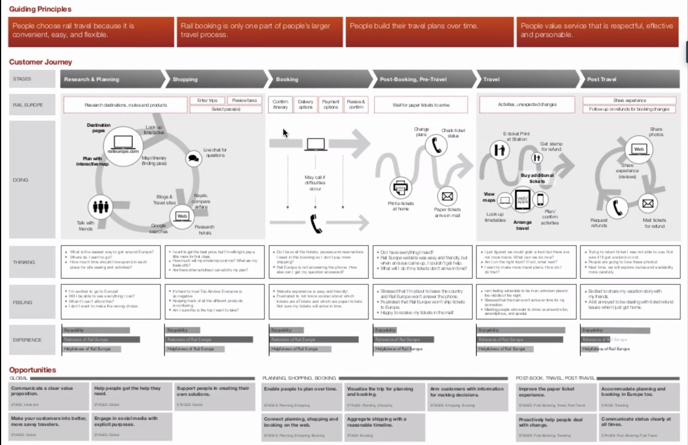
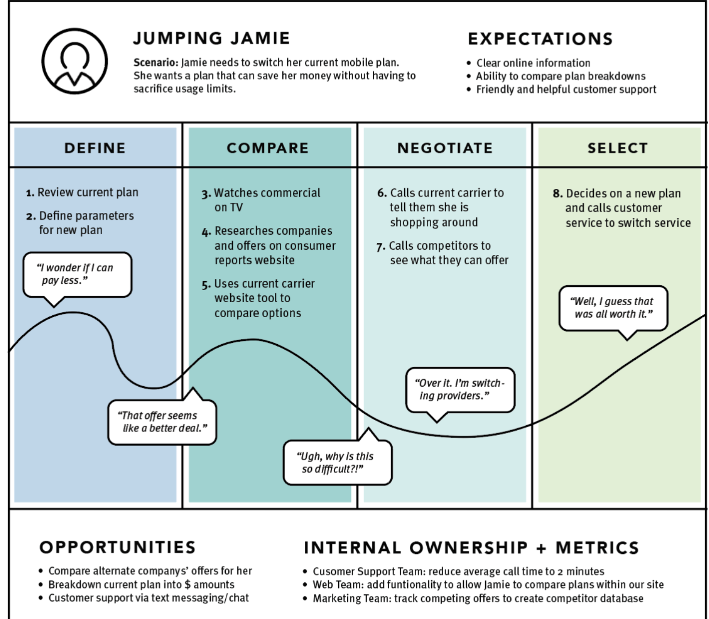
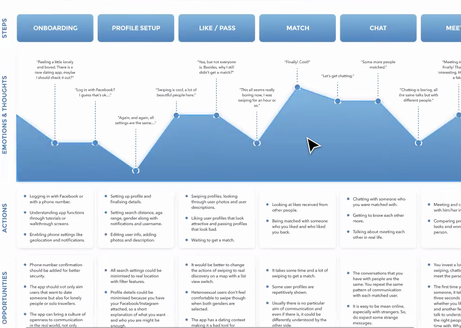
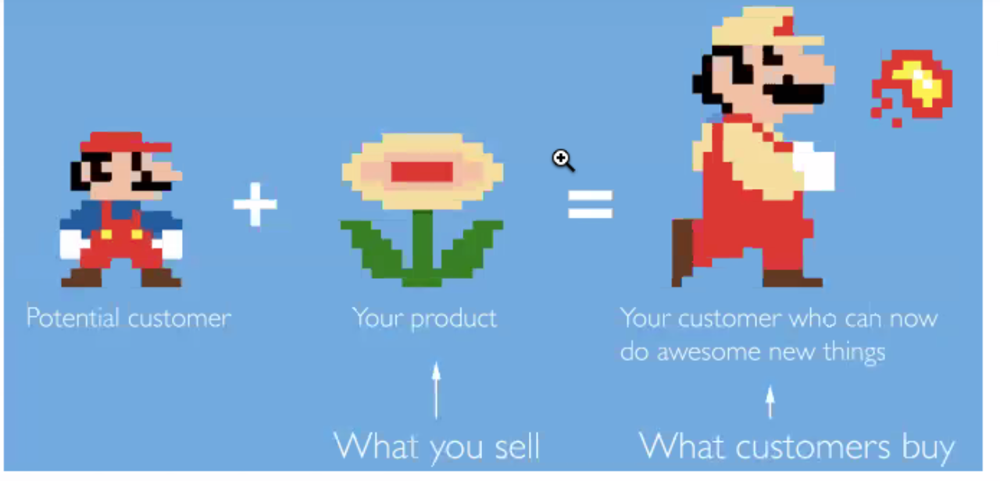

# Journey Maps 

Table of Contents:  

a. [Additional Resources](#Additional-Resources)     
b. [Journey Maps](#Journey-Maps)        
c. [Journey Map Elements](#Journey-Map-Elements)     
d. [Creating a Journey Map](#Creating-a-Journey-Map)    
e. [Jobs To Be Done](#Jobs-To-Be-Done)     

 

## Additional Resources

#### Pre-Class Videos

[Journey Maps (2 min)](https://youtu.be/nzSryfc5q-8)  

[Creating a Journey Map (8 min)](https://youtu.be/xY8E7DGsWi0) 

#### Assignment

[Journey Maps UX8 - Glenn Ference](https://youtu.be/yysYGkInnos)  

[Journey Maps UXPT3 - Ann-Marie](https://youtu.be/tdHus_37Ig8)     

[Journey Maps Assignment](https://drive.google.com/open?id=16uCEHmeSC8OO7UFIpNMMftMUojEyy2NCQTZ_linSrzQ)  

#### Other Cool Links

[Journey Mapping 101](https://www.nngroup.com/articles/journey-mapping-101/) byt the Nielsen Norman Group. 

[User Journey's, the Beginner's Guide](https://theuxreview.co.uk/user-journeys-beginners-guide/)   

[What is a User Journey Map?](https://www.optimizely.com/optimization-glossary/user-journey-map/)   

[10 Interesting User Journey Map Examples](http://blog.uxeria.com/en/10-most-interesting-examples-of-customer-journey-maps/)  

[9 Ways to Build Great User Journey Maps](https://www.mycustomer.com/experience/engagement/nine-sample-customer-journey-maps-and-what-we-can-learn-from-them), with examples.  

[Smaply](https://www.smaply.com), visualize your customers' experience (paid).  

[The ultimate guide to creating a customer experience map](https://www.ngdata.com/creating-a-customer-experience-map), with analysis, tools and templates.  

 

Experience Design at Habanero: [Part 1](https://www.youtube.com/watch?v=6hgq5eIAKWc), [Part 2](https://www.youtube.com/watch?v=tzTQH7nrf3g), and [Part 3](https://www.youtube.com/watch?v=9JCM4zc0Iyk).  

 

## Journey Maps

Most organizations have a difficult time understanding how their customer interacts with their business. Oftentimes, information is siloed in different parts of the company and it’s rarely extracted for everyone’s benefit.

Furthermore, most organizations don’t take a user-centered approach to their daily operations. So, new initiatives and ideas are typically internally sourced and developed with little to no consideration for the user. Yikes!

### Refocus on User Needs

As UX designers, we need to be able to free up our organization’s information and refocus everyone on solving user needs. Fortunately, we can use a customer journey map to solve these problems.

What is a Journey Map?

According to the Nielsen Norman Group (NNGroup):

>> ”A customer journey map is a visualization of the process that a person goes through in order to accomplish a goal.”   

They combine storytelling and visualization to help teams conceptualize and address customer needs. Their unique format and ability to surface missing details make them excellent tools for defining the high-level customer experience.

Additionally, they help draw out siloed information because they’re created using a collaborative, multi-disciplinary approach. And since we’re focused on the customer’s journey, it refocuses the team on the customer’s needs and pain points.

 

### What are the benefits?

User Journey Maps are another way to express the user's needs and perspectives to team members who might not understand the user as well, or engage with the user as often. It helps build empathy and a user first mindset. The whole team needs to be on board so that the more viewpoints that go into creating it can build a robust user perspective. 

 

### How does it differ from an Experience Map?

An experience map looks at the entire possible user experience, including edge cases or the global view, rather than focusing on a user persona's particular journey through the app or service. Journey Maps really focus on a persona's perspective rather than every possible scenario that could occur.

An experience map helps expose the different stages, touch points, and channels that users might go through. This is a great resource to create when you are new to a company or organization, to understand the big picture of the whole process or a sub-process (getting a mortgage from the bank). 

They can also help us understand the journey that might bridge from online to offline, or vice versa.

Channels are methods of communication or service, touch points are when users engage with those channels. 

Now, there are so many types of touch points or channels that users can connect to a company with, but they aren't always interconnected (phone support might not be able to connect to the online chat support or the support history of a customer). Despite a company being one group, the channels can be disconnected, but customers usual expect a fully connected experience across all channels.

 

A user journey map might look more like this, where we track each step of the user journey around a single user or persona, with a visualization of their emotional state throughout, corresponding to particular pieces of feedback or observations.

 

 
 

## Journey Map Elements

Like most UX tools, there’s a fair amount of variation in how people design and organize their customer journey maps.

First, we’ll want to make sure that our customer journey map lays out the experience for one “actor” or persona. 

Keeping our maps focused on one persona prevents us from overcomplicating our designs. 

If we tried to design for many personas, it would be hard to visually represent and digest all of their information. So, be sure to create a separate map for each persona in order to provide a strong, clear narrative.

 

### 1. Scenario

The scenario refers to the specific experience you’re mapping. 

Ideally, your scenario describes a sequence of events, like using an online shopping cart or flying to Spain. You should also make sure that your scenario has an end goal for the user and that it’s clearly articulated.

 

### 2. Actions, Mindsets, and Emotions

A journey map wouldn’t be very useful without showing what the user is doing, thinking, and feeling during their journey. 

These details should be found through qualitative research. But, it’s ok to guess if you don’t have any supporting research as long as you validate your guesses in follow-up research.

 

### 3. Touchpoints and Channels

As NNGroup explains: 

>> ”the map should align touchpoints (times when the [persona] actually interacts with the company) and channels (methods of communication or service delivery, such as the website or physical store) with user goals and actions. These elements deserve a special emphasis because they are often where brand inconsistencies and disconnected experiences are uncovered.”

 

### 4. Insights and Ownership

Insights and ownership are paradoxically the most important and overlooked pieces of the customer journey map. 

The whole point of creating a customer journey map is to discover where you could improve the customer’s experience with your company and product. 

So, failing to include insights means that all of the other work you’ve done for your map was a waste of time. 

Since you’ll always include the insights section, you’ll also make sure to assign ownership to your insights so your teammates are empowered to make the changes you need to implement them.

 
 

## Creating a Journey Map

Now that we understand the various elements of a typical customer journey map, let’s cover the process for creating them.

### 1. Understand your context

As usual, we’ll need to gather up all of our research insights to serve as the foundation for our customer journey map. 

In particular, it helps to understand your personas, products, and business objectives. 

With this information, we’re looking to understand our customers, how/when/why they interact with our products, and what we’re doing as a business to facilitate those interactions.

 

### 2. Plan your mapping event

Once you’ve gathered up all of your research, you can start planning your mapping event. Creating a customer journey map is a collaborative process that should uncover siloed information and lead to insights across the organization. 

So, you need to make sure you invite other stakeholders to participate. There are two types of stakeholders who you should invite.

Ones who understand the customer journey and influencers in your organization. Sometimes they’ll overlap, but in larger companies, they might not. 

Influencers are typically members of senior management. They're often the farthest from customers, but their decisions carry the biggest impact on the customer experience. Having them attend the event helps them see how their decisions impact the customer experience. 

In order to do that, you’ll need to have stakeholders who actually understand the full customer journey. Usually, customer support/service staff are excellent stakeholders who understand the customer’s problems very well. Other stakeholders include marketers, salespeople, developers, and other UX designers.

Once you’ve identified the stakeholders, invite them to your customer mapping event. 

Make sure you explain why you’re conducting this exercise and the value it will deliver for them. These events can last all day, but make sure you’ve budgeted at least 90 minutes. Anything past that is often too taxing for teams. 

It might seem like not enough time to get all of the details, but remember you’re trying to leverage the team’s knowledge to uncover the basic facts and high-level customer journey. You can always follow-up with individuals for more detail later.

 

### 3. Collaborate with your team

When you’ve gathered everyone in a room, you’re ready to start working on your customer journey map. At the beginning, make sure to review what you’re doing, why it is useful, and how it will benefit the company.

When you’re ready, start by identifying the persona that you’ll be focusing on. Then, identify the scenario and the principal stages the persona passes through in order to complete it. These stages can vary dramatically, but will typically cover the following:

> Discovery  
> Research  
> Purchase  
> Delivery  
> After Sales  

 

Once you’ve outlined your scenario, you can create a grid on a large piece of paper or a whiteboard. At the top, create a column for each of the stages. On the left side, create a row for the actions, mindsets, emotions, touchpoints, channels, insights, and ownership.

With that set-up, go through the process of filling out the first column with everyone. Make sure you use post-it notes for all of your responses. This makes it easy to reorder items later.

Once you’ve finished the first column, you can either continue as a team or break out into smaller groups and have them each work on a column together. Breaking into smaller groups helps keep everyone engaged and speeds up the process.

When everything is filled out, make sure you review all of the details together and discuss any contentious points.

 

### 4. Refine your map

Now that you have all of the big picture details, you can continue to add more details or you can codify your findings in a deliverable. 

Customer journey maps come in all shapes and sizes, but make sure you present all of your findings on one page. Keeping everything on one page ensures it is easily digestible and more likely to be used and referenced.

 

### 5. Share your results

Once you’ve refined your customer journey map, you’re ready to share it with the rest of your team! Sharing your results is the most important step because it ensures that all of the work you just did doesn’t go to waste. 

Make sure everyone understands the implications of the customer journey map and any results that they’ll be responsible for because of it.

 
 

## Jobs To Be Done

 

In person project: Try to outline a user journey map of [Cinebox](https://docs.google.com/document/d/1WuOjbm_zqjWnt_pRGOlK1pAInt60H5I6Vb6SOMjAOnI/edit). Use [how to create a customer journey map](https://www.ngdata.com/how-to-create-a-customer-journey-map/) as a reference. Use this [Figma Journey Map template](https://www.figma.com/file/pYZulEMUfqhrpbFZitK5PP/Journey-Map-Template). 

 